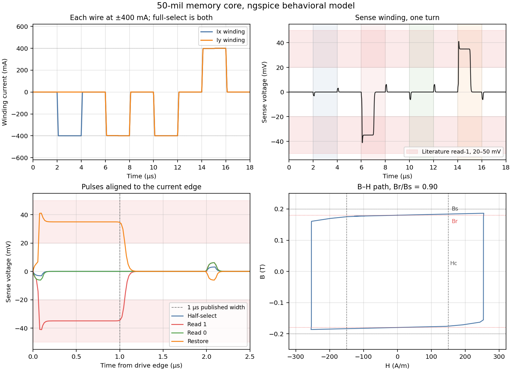
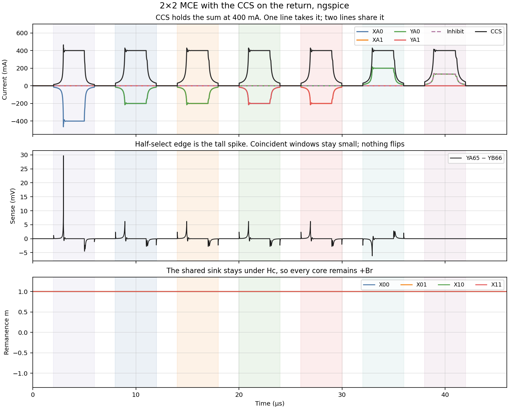
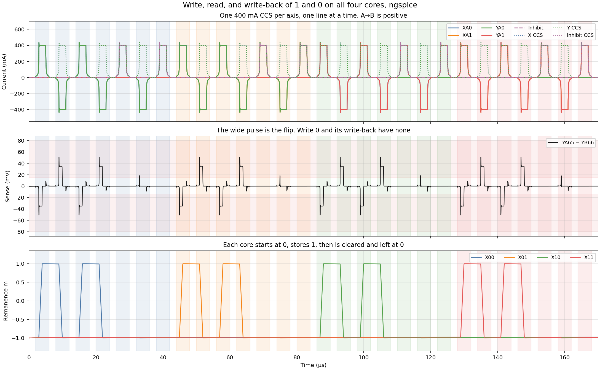
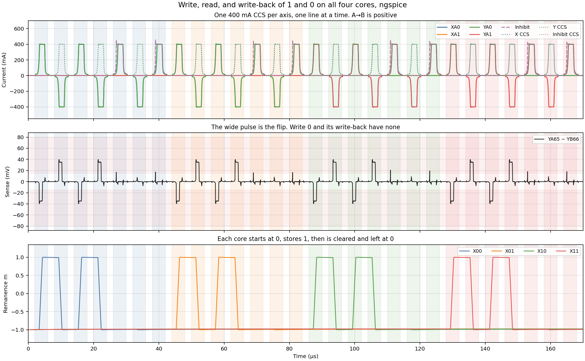

# Core-Element Simulation

SPICE model of one three-wire memory core. The driver schematic uses it as the MCE (magnetic core element) symbol on [ferrite_beads.kicad_sch](../kicad/core/ferrite_beads.kicad_sch): the same six pins as the old ferrite-bead stand-in, with the flux probe kept inside the `mce` wrapper. This project remains the isolated testbench.

KiCad project: [kicad/core_element_sim/](../kicad/core_element_sim/). Subcircuit: [models/coremem.cir](../kicad/core_element_sim/models/coremem.cir). Batch deck: [models/coremem_tb.cir](../kicad/core_element_sim/models/coremem_tb.cir).

## Why this is not the LTspice Chan `K` statement

KiCad simulates with ngspice. In that engine a `K` line is a linear coupling coefficient. It does not accept the Chan parameters `Hc`, `Br`, `Bs`, `Lm`, and `A` that LTspice puts on a mutual inductor (Chan et al., IEEE Trans. CAD, 1991; see [references.md](references.md)).

Two further limits pushed the model off that formulation:

- Memory squareness here is \(B_r/B_s = 0.18/0.20 = 0.90\). LTspice’s Chan solver is known to stall when that ratio is much above about \(2/3\), especially under one-sided saturation.
- A 20–50 mV sense pulse across a 10–50 Ω damper is only a couple of milliamps. With ideal current sources that resistor does not stretch the flip out to 1 µs. The peaking time is a parameter of the core, `Tsw`.

The subcircuit still takes the same physical numbers. Switching is a domain-wall time: while \(|H| > H_c\), the normalized remanence \(m\) slews toward the driven rail in about `Tsw`, and each winding voltage is Faraday’s law, \(V = A\,dB/dt\), with \(B = B_r m + \mu_0 \mu_r H\) clamped to \(\pm B_s\).

## Geometry and material (50-mil toroid)

This run uses a typical vintage 50-mil core, not the 0.125 in diameter inferred in [design_spec.md](design_spec.md) §4 from the edge-contact width. The plane’s normative full-select band (400–800 mA) is unchanged. The half-select used below, 400 mA, is the top of that band and is the current the coercivity was matched to.

| Quantity | Value | Origin |
|----------|-------|--------|
| Outer / inner diameter | 1.27 mm / 0.76 mm | 50-mil toroid |
| Mean diameter | 1.0 mm | average of OD and ID |
| Magnetic path \(L_m\) | 0.00314 m | \(\pi \times 1.0\,\mathrm{mm}\) |
| Wall × height | 0.255 mm × 0.38 mm | \((OD-ID)/2\), typical height |
| Area \(A\) | \(0.097\times 10^{-6}\,\mathrm{m}^2\) | wall × height |
| \(B_s\), \(B_r\) | 0.20 T, 0.18 T | squareness \(B_r/B_s = 0.90\) |
| \(H_c\) | 150 A/m (about 1.9 Oe) | below full-select, above half-select |
| Turns | 1 on X, Y, and sense | three-wire core |
| `Tsw` | 1 µs | full-select peaking time |
| \(\mu_r\) | 20 | reversible permeability for the disturb |

Ampere’s law on one turn, \(H = I/L_m\):

- Half-select, 400 mA on X only: \(H \approx 127\,\mathrm{A/m}\), under \(H_c\). The core stays at \(+B_r\).
- Full-select, 400 mA on X and on Y: \(H \approx 255\,\mathrm{A/m}\), over \(H_c\). The core flips.

A remanence reversal \(\Delta B = 2 B_r\) through area \(A\) in 1 µs is an average sense voltage of about 35 mV, inside the 20–50 mV band expected for a single core with one sense turn.

## Stimulus

One 18 µs transient, 100 ns edges, X2/Y2/S2 grounded, 20 Ω across X and across Y. The core starts at \(m = +1\) (`tran … uic`).

| Window | Drive | Intended result |
|--------|-------|-----------------|
| 2–4 µs | \(I_x = -400\,\mathrm{mA}\) | half-select disturb |
| 6–8 µs | \(I_x = I_y = -400\,\mathrm{mA}\) | read 1, \(+B_r \to -B_r\) |
| 10–12 µs | same full-select again | read 0, already at \(-B_r\) |
| 14–16 µs | \(I_x = I_y = +400\,\mathrm{mA}\) | restore to \(+B_r\) |

Open [core_element_sim.kicad_pro](../kicad/core_element_sim/core_element_sim.kicad_pro) and run the simulator; the sheet carries `.tran 20n 18u uic`. Plot `V(S1)` and `V(B)` (1 V on `B` is 1 T). The same deck from the shell:

```bash
ngspice -b kicad/core_element_sim/models/coremem_tb.cir   # RESULT PASS or RESULT FAIL
python3 kicad/core_element_sim/plot_response.py           # plots/coremem_response.png
```

`ngspice` the program is optional. The plot script talks to `libngspice`, which is the library KiCad already uses. Regenerate the sheet with `uv run python kicad/scripts/gen_core_element_sim.py`.

## Comparison with the literature



The pink band on the sense plots is 20–50 mV. The dashed line on the aligned pulses is 1 µs. Both are the single-core targets used to size this model (one sense turn), in the same range as the millivolt, microsecond sense signals of coincident-current practice (Forrester 1951; Papian 1952; Rajchman 1953). They are not a trace digitized from a particular oscilloscope photo.

Numbers from the plot above:

| Event | Sense peak | Width at half amplitude | Remanence after the pulse |
|-------|------------|-------------------------|---------------------------|
| Half-select | −3.1 mV | 0.11 µs | stays \(+B_r\) (\(m \approx +1\)) |
| Read 1 | −41 mV | 1.01 µs | flips to \(-B_r\) |
| Read 0 | −6.2 mV | 0.12 µs | stays \(-B_r\) |
| Restore | +41 mV | 1.02 µs | returns to \(+B_r\) |

What lines up with the classic behavior:

- Only the intersection flips. Half-select field stays under \(H_c\), and a second full-select in the same direction does not flip the core again (Rajchman; Papian).
- The read-1 and the restore are tens of millivolts and about 1 µs wide. The read-0 and the half-select disturb are several times smaller, which is the discrimination a sense amplifier needs.
- The B–H path is square, with \(B_r/B_s = 0.90\). \(H_c = 150\,\mathrm{A/m}\) is about 1.9 Oe, in the range memory ferrites were specified in.

Where the waveform is not a scope photo:

Published read-1 pulses are bell-shaped. Menyuk and Goodenough (1955) describe flux reversal whose rate peaks in the middle of the switch, because that is when the domain-wall area is largest. This model slews \(m\) at a nearly constant rate once \(|H| > H_c\), so \(dB/dt\) is flat for about 1 µs. The spikes at the start and end of each current edge are the reversible term \(\mu_0 \mu_r dH/dt\), not the flip. The 20 Ω dampers are on the testbench, as in the original damping note; at these sense voltages they do not set the 1 µs width.

The read-1 peak (−41 mV) is the ~35 mV remanence reversal plus the reversible edge at the start of the ramp. Polarity follows the drive: negative current produces a negative read-1; the restore is the opposite spike.

## 2×2 addressing

The Magnetic Cores sheet places four of these cores in the plane’s weave: YA loop through MCE11 and MCE00 (mirrored, top-left to bottom-right), YB loop through MCE10 and MCE01, ends at the XB end of each Y edge, fold `YA66`═`YB65`. The batch deck uses that netlist after the sheet’s `Sim.Pins` map, so current XA→XB and YA→YB both add to H, and current YA65→YB66 opposes a positive write.

This deck is the single-sink record. The return is one copy of the schematic CCS (`models/ccs.cir`): TL431 at 2.5 V, the 10 kΩ pot set for 400 mA, OPA192, IRLZ44N, and the 1 Ω sense resistor. Selected ends are switched from a 12 V testbench rail; the other end of each driven line, and the inhibit sink, all return through that one node. The schematic does not: X, Y, and inhibit each have their own sink. In the model the op-amp output is held at 2.39 V, just above the gate that regulates 400 mA, so an open return does not wind the MOSFET up to the +5 V rail between pulses.

```bash
ngspice -b kicad/core_element_sim/models/array2x2_tb.cir   # RESULT PASS or RESULT FAIL
python3 kicad/core_element_sim/plot_array.py              # plots/array2x2_response.png
```

One 46 µs transient, cores starting at \(m=+1\). Each pulse is a 1 µs rise, a 2 µs flat, and a 1 µs fall. Read polarity sinks the A end (current B→A). Write sinks the B end. The last window is a write of X1/Y0 with inhibit current also returned through the CCS.



What the run checks:

- The sink holds 400 mA on every flat top. A single line carries that whole current. Two lines split it, about 200 mA each. Inhibit is a third path, about 134 mA, and the sum is still 400 mA.
- That split stays under \(H_c\). Half-select, every address window, the restore, and the inhibited write all leave every core at \(+B_r\).
- The half-select edge is a reversible spike of about 30 mV on `YA65`−`YB66`, from the single line taking the full 400 mA. Coincident windows are a few millivolts. Nothing on this string is a flip.

## Read / write-back

One shared sink cannot put 400 mA on X and 400 mA on Y together, so a read cannot flip the addressed core. `array2x2_cycle_tb.cir` keeps the same CCS circuit and gives the X lines, the Y lines, and the inhibit path each their own copy, every one set to 400 mA. That is the schematic: root sheets CCS X, CCS Y, and CCS INH.

All four cores start at \(-B_r\). The run visits X00, then X01, then X10, then X11. Each pulse is a 1 µs rise, a 2 µs flat, and a 1 µs fall. X and Y each have one CCS, shared by the two lines of that axis, and only one of those lines is on at a time. Inhibit has its own CCS.

```bash
ngspice -b kicad/core_element_sim/models/array2x2_cycle_tb.cir   # RESULT PASS or RESULT FAIL
python3 kicad/core_element_sim/plot_cycle.py                     # plots/array2x2_cycle.png
```



What the run checks, on every core:

- Write 1 drives +400 mA on that core’s X line and Y line. The core goes to \(+B_r\). The sense plateau is about −35 mV. The other three cores stay at \(-B_r\).
- Read drives −400 mA on the same two lines. The core goes to \(-B_r\), and the plateau is about +35 mV.
- Write-back drives +400 mA again. The core returns to \(+B_r\).
- Storing a 0 starts with that same read, which clears the 1. The write then adds 400 mA inhibit on YA65→YB66, so the core stays at \(-B_r\) and the plateau collapses. Inhibit current also threads the other three cores and does not flip them.
- Read of that 0 leaves the core at \(-B_r\). The reversible edge is still there; the flip plateau is not. Write-back of the 0 is the inhibited write again, and the core stays at \(-B_r\).

The same cycle is re-run with the real blocks in place of the ideal switches. `array2x2_drive_tb.cir` puts one `drvleg` on X0. `array2x2_matrix_tb.cir` is the diode matrix (shared group-0 high side, low side selects the line). `array2x2_inhibit_tb.cir` and `array2x2_sense_tb.cir` add inhibit and the sense latch. `array2x2_e2e_tb.cir` starts from `ADDR_*`, `DEC_EN`, `FWD_EN_n`, `REV_EN_n`, `INH_EN_n`, and `SENSE_STROBE`.

```bash
ngspice -b kicad/core_element_sim/models/array2x2_e2e_tb.cir   # RESULT PASS or RESULT FAIL
python3 kicad/core_element_sim/plot_e2e.py                     # plots/array2x2_e2e.png
```



## What each deck includes

Magnetic Cores (four `mce` cores, the fold, and the 10 kΩ center tap) are in every array deck. `array2x2_tb.cir` is the one-sink record. Every other array deck instances the CCS subcircuit three times.

| Deck | Beyond cores and the CCS copies |
|------|--------------------------------|
| `array2x2_tb.cir` | One CCS. Ideal line switches. |
| `array2x2_cycle_tb.cir` | Three CCS copies. Ideal line switches. Oracle for remanence, ±400 mA, and the sense plateau. |
| `array2x2_drive_tb.cir` | `drive.cir` on the X0 pair. Other switches stay ideal. |
| `array2x2_matrix_tb.cir` | `drive.cir` on all eight half-bridges, diode steering. |
| `array2x2_inhibit_tb.cir` | Matrix, plus `inhibit.cir` returned to `CCS_INH`. |
| `array2x2_sense_tb.cir` | Inhibit deck, plus `sense.cir` and `DOUT`. |
| `array2x2_e2e_tb.cir` | Sense deck, plus `decode.cir`. Stimulus is the address and enable pins. |

`array2x2_e2e_tb.cir` also has the Decode CTRL pulls: 10 kΩ down on `DEC_EN`, 10 kΩ up on `FWD_EN_n` and `REV_EN_n`. After the cycle the sources open. The pulls hold every gate off, and `DOUT` stays low. During an X0 read, `X_HS2_n` and `Y_HS7_n` stay high and `X_LS2_en` / `Y_LS7_en` stay low, so the groups the 2×2 address does not use stay off.

`array2x2_strobe_tb.cir` is that deck with the sheet sense front-end: 1 kΩ, the clamps, the comparator, and the latch. The strobe is 300 ns into the flat. 200 ns and 250 ns do not latch a logic 1. A following X-only half-select does not latch a 1.

`array2x2_z_tb.cir` inserts one series R and one series L on each drive line and on the sense string. The default is 1 µΩ and 1 pH, and that run still passes. [theory_of_operation.md](theory_of_operation.md) records no numeric weave L or DCR, so there is no second run with a real plane impedance.

Still out of every netlist: the decoupling caps, and C5/C6 inside `ccs.cir`. They sit on ideal rails. The root schematic now has drive groups 0–7, steer diodes for lines 0–63, an edge contact on each plane net, and an RP2040 header on the address and enable nets. The transient is still four cores.
