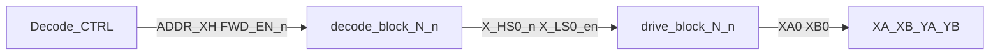

# Signal naming and hierarchical scale path

Normative net grammar and KiCad hierarchy methodology for the core-plane driver. Physical connector contract: [design_spec.md](design_spec.md). Block map: [regions.md](regions.md).

**Rule:** the hierarchical sheet is a *function*; root wires are the *call arguments*. Define logic once; instantiate and scale with buses and layout replication.

## 1. Three naming layers

| Layer | What it is | Drive lines | Sense / fold |
|-------|------------|-------------|--------------|
| **Physical** | Stamped on the plane PCB | Contacts **1–64** on XA/XB/YA/YB | Y contacts **65**, **66** |
| **Syntax** | Nets / code / KiCad hierarchy | `XA0`…`XA63` (0-based); block tokens `N`/`n` | `YA65`…`YB66` — **outside** Drive/Decode sheet pins |
| **Semantic** | Function | Half-select matrix | READ pickup + inhibit fold — **not** drive lines |

Map: physical contact \(p\) ↔ logical index \(p-1\). Never invent drive net `XA64`. Never put 65/66 in the Drive/Decode pin chain.

## 2. Gate / enable nets (matrix control)

Format: `[N]_[func][n][dir]_[logic]`

| Token | Meaning | Valid values |
|-------|---------|--------------|
| `N` | Axis | `X`, `Y` |
| `func` | Hardware role | `HS` (high-side), `LS` (low-side) |
| `n` | Index | Line `0`…`63`, or decode bank `0`…`7` |
| `dir` | Drive direction | omit = FWD/READ; `r` = REV/WRITE |
| `logic` | Active level | `_n` = active-low; `_en` = active-high (always explicit; do not use a bare blank) |

**Examples (in tree today):** `X_HS0_n`, `X_LS0_en`.

**Examples (future REV):** `X_HS0r_n`, `X_LS0r_en`, `Y_HS3r_n`.

**Audit regex (gate nets):**

```text
^[XY]_(HS|LS)[0-9]{1,2}r?_(n|en)$
```

## 3. Plane drive nets

Format: `[N][end][n]`

| Token | Meaning | Values |
|-------|---------|--------|
| `N` | Axis | `X`, `Y` |
| `end` | Connector side | `A` (HS end), `B` (LS end) |
| `n` | Logical line | `0`…`63` |

Examples: `XA0`, `XB0`, `YA17`, `YB63`. Physical contact number = \(n+1\).

## 4. Global and special nets

| Class | Nets |
|-------|------|
| Enables | `FWD_EN_n`, `REV_EN_n`, `INH_EN_n`, `DEC_EN` |
| Analog / power | `VDRIVE`, `CCS_RET`, `SENSE_P`, `SENSE_N`, `AGND`, `+3V3`, `+5V` |
| Sense / fold (not Drive/Decode hierarchy) | `YA65`, `YB65`, `YA66`, `YB66`, `SENSE_FOLD` |

Fold model: two independent loops `YA65`↔`YA66` and `YB65`↔`YB66`. The plane does not join them. Schematic center-tap node is **`SENSE_FOLD`**: `YA66` tied to `YB65`, soft ground 10 kΩ→AGND. Outer ends: `YA65` / `YB66`. See [theory_of_operation.md](theory_of_operation.md).

## 5. Hierarchical block ABI (reusable sheets)

Parent nets use §2–§4. **Inside** reusable sheets, pins stay parameterized with **`N`** (axis) and **`n`** (line or bank). Do not rename live block pins to `HS_CTRL_n` / `NODE_OUT` — the half-bridge needs **two** plane ends.

### Drive Block — [`drive_block.kicad_sch`](../kicad/core/drive_block.kicad_sch)

One TC4427A + FDS8958A + SS14×2 + local VDRIVE bypass. Hierarchical pins:

| Pin | Role | Example parent (X0 FWD) |
|-----|------|-------------------------|
| `N_HSn` | HS gate (active-low) | `X_HS0_n` |
| `N_LSn` | LS gate (active-high) | `X_LS0_en` |
| `NAn` | Plane HS end | `XA0` |
| `NBn` | Plane LS end | `XB0` |
| `VDRIVE` / `CCS_RET` | Rails | globals |

### Decode Block — [`decode_block.kicad_sch`](../kicad/core/decode_block.kicad_sch)

One axis: 74AHC138 HS + 74AHC238 LS. Hierarchical pins:

| Pin | Role | Example parent (X FWD) |
|-----|------|------------------------|
| `ADDR_NH[2:0]` / `ADDR_NL[2:0]` | Bank address | `ADDR_XH*` / `ADDR_XL*` |
| `BANK_EN` / `DEC_EN` | Bank / chip enable | `FWD_EN_n` / `DEC_EN` |
| `N_HS{0..7}_n` | HS outs | `X_HS0_n` … `X_HS7_n` |
| `N_LS{0..7}_en` | LS outs | `X_LS0_en` … `X_LS7_en` |

`line# = 8·HS + LS` (logical 0…63).

## 6. Hierarchy as function call / instance



1. **Define once** — atomic `drive_block` / `decode_block` with `N`/`n` hierarchical pins.
2. **Instantiate on root** — today 1× each (X FWD decode, X0 FWD drive). Later clone for Y and REV (`BANK_EN`←`REV_EN_n`, outs → `*r_*`; drive REV swaps `NAn`/`NBn`).
3. **Scale with buses** — when past 1×1, root may use KiCad buses such as `X_HS[0..7]_n` and `X_LS[0..7]_en` so the top sheet stays a few thick vectors instead of dozens of wires.
4. **PCB multiplier** — route and pour **one** Drive Block instance cleanly, then use the **Replicate Layout** plugin to copy placement and copper to further instances (7 more for an 8-line bank, or more toward 64). Hierarchy makes instance membership unambiguous for the plugin.

## 7. Scale roadmap (not implemented yet)

| Step | Schematic | PCB |
|------|-----------|-----|
| Now | 1× decode_block (X FWD), 1× drive_block (X0 FWD) | Single block layout TBD |
| Next | Y FWD + X/Y REV sheet instances; `*r_*` nets | Replicate Drive Block |
| Later | Buses on root; full 8×8 banks | Replicate across banks |

## 8. What never enters the Drive/Decode chain

`YA65`, `YB65`, `YA66`, `YB66`, and `SENSE_FOLD` are sense/fold only. They may appear as local labels on the Magnetic Cores sheet or as Sense/Inhibit hierarchical pins, but they are **not** `NAn`/`NBn` with n≥64 and are **not** decode outputs.
