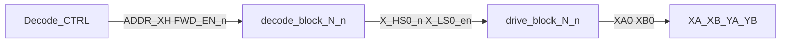

# Signal naming and hierarchical scale path

Normative net grammar and KiCad hierarchy methodology for the core-plane driver. Physical connector contract: [design_spec.md](design_spec.md). Block map: [regions.md](regions.md).

**Rule:** the hierarchical sheet is a *function*; root wires are the *call arguments*. Define logic once; instantiate and scale with buses and layout replication.

## 1. Three naming layers

| Layer | What it is | Drive lines | Sense / fold |
|-------|------------|-------------|--------------|
| **Physical** | Stamped on the plane PCB | Contacts **1–64** on XA/XB/YA/YB | Y contacts **65**, **66** |
| **Syntax** | Nets / code / KiCad hierarchy | `XA0`…`XA63` (0-based); block tokens `N`/`n` | `YA65`…`YB66` — **outside** Drive/Decode sheet pins |
| **Semantic** | Function | Half-select matrix | READ pickup + inhibit fold — **not** drive lines |

Map: physical contact \(p\) ↔ logical index \(p-1\). Never invent drive net `XA64`. Never put 65/66 in the Drive/Decode pin chain.

## 2. Gate / enable nets (matrix control)

Format: `[N]_[func][n][dir]_[logic]`

| Token | Meaning | Valid values |
|-------|---------|--------------|
| `N` | Axis | `X`, `Y` |
| `func` | Hardware role | `HS` (high-side), `LS` (low-side) |
| `n` | Index | Line `0`…`63`, or decode bank `0`…`7` |
| `dir` | Drive direction | omit = FWD/READ; `r` = REV/WRITE |
| `logic` | Active level | `_n` = active-low; `_en` = active-high (always explicit; do not use a bare blank) |

**Examples (in tree today):** `X_HS0_n`, `X_LS0_en`.

**Examples (future REV):** `X_HS0r_n`, `X_LS0r_en`, `Y_HS3r_n`.

**Audit regex (gate nets):**

```text
^[XY]_(HS|LS)[0-9]{1,2}r?_(n|en)$
```

## 3. Plane drive nets

Format: `[N][end][n]`

| Token | Meaning | Values |
|-------|---------|--------|
| `N` | Axis | `X`, `Y` |
| `end` | Connector side | `A` (HS end), `B` (LS end) |
| `n` | Logical line | `0`…`63` |

Examples: `XA0`, `XB0`, `YA17`, `YB63`. Physical contact number = \(n+1\).

## 4. Global and special nets

| Class | Nets |
|-------|------|
| Enables | `FWD_EN_n`, `REV_EN_n`, `INH_EN_n`, `DEC_EN` |
| Analog / power | `VDRIVE`, `CCS_X`, `CCS_Y`, `CCS_INH`, `SENSE_P`, `SENSE_N`, `AGND`, `+3V3`, `+5V` |
| Sense / fold (not Drive/Decode hierarchy) | `YA65`, `YB65`, `YA66`, `YB66`, `SENSE_FOLD` |

Fold model: two independent loops `YA65`↔`YA66` and `YB65`↔`YB66`. The plane does not join them. Schematic center-tap node is **`SENSE_FOLD`**: `YA66` tied to `YB65`, soft ground 10 kΩ→AGND. Outer ends: `YA65` / `YB66`. See [theory_of_operation.md](theory_of_operation.md).

## 5. Hierarchical block ABI (reusable sheets)

Parent nets use §2–§4. **Inside** reusable sheets, pins stay parameterized with **`N`** (axis) and **`n`** (line or bank). Do not rename live block pins to `HS_CTRL_n` / `NODE_OUT` — the half-bridge needs **two** plane ends.

### Drive Block — [`drive_block.kicad_sch`](../kicad/core/drive_block.kicad_sch)

One TC4427A + FDS8958A + local VDRIVE bypass. The SS14s sit on [`steer_64.kicad_sch`](../kicad/core/steer_64.kicad_sch), not inside the block. Hierarchical pins:

| Pin | Role | Example parent (X0 FWD) |
|-----|------|-------------------------|
| `N_HSn` | HS gate (active-low) | `X_HS0_n` |
| `N_LSn` | LS gate (active-high) | `X_LS0_en` |
| `N_HS_OUT` | P-FET switch node | `XHS0` |
| `N_LS_OUT` | N-FET switch node | `XLS0` |
| `VDRIVE` / `CCS_RET` | Rails | `VDRIVE`; parent binds `CCS_X` or `CCS_Y` |

### Decode Block — [`decode_block.kicad_sch`](../kicad/core/decode_block.kicad_sch)

One axis: 74AHC138 HS + 74AHC238 LS. Hierarchical pins:

| Pin | Role | Example parent (X FWD) |
|-----|------|------------------------|
| `ADDR_NH[2:0]` / `ADDR_NL[2:0]` | Bank address | `ADDR_XH*` / `ADDR_XL*` |
| `BANK_EN` / `DEC_EN` | Bank / chip enable | `FWD_EN_n` / `DEC_EN` |
| `N_HS{0..7}_n` | HS outs | `X_HS0_n` … `X_HS7_n` |
| `N_LS{0..7}_en` | LS outs | `X_LS0_en` … `X_LS7_en` |

`line# = 8·HS + LS` (logical 0…63).

### Decode CTRL — [`decode_ctrl.kicad_sch`](../kicad/core/decode_ctrl.kicad_sch)

Address and bank-enable headers. Same split as Drive and Decode: hierarchical pins are the function; root labels are the arguments. One axis of address per sheet. Enable headers exist once (they are not per-axis).

| Pin | Role | Example parent |
|-----|------|----------------|
| `ADDR_NH[2:0]` | HS address | `ADDR_XH*` (X sheet) / `ADDR_YH*` (Y sheet) |
| `ADDR_NL[2:0]` | LS address | `ADDR_XL*` / `ADDR_YL*` |
| `BANK_EN` | Bank enable, 10 kΩ to +3V3 | `FWD_EN_n` |
| `DEC_EN` | Chip enable, 10 kΩ to GND | `DEC_EN` |
| `REV_EN_n` | Reverse bank enable, 10 kΩ to +3V3 | `REV_EN_n` |

`BANK_EN` / `DEC_EN` / `REV_EN_n` are only on the X sheet ([`decode_ctrl.kicad_sch`](../kicad/core/decode_ctrl.kicad_sch), J40–J45 and J52–J54). The Y sheet ([`decode_ctrl_y.kicad_sch`](../kicad/core/decode_ctrl_y.kicad_sch), J46–J51) is the same address pins bound to `ADDR_Y*`, so the enable headers are not cloned.

## 6. Hierarchy as function call / instance



1. **Define once** — atomic `drive_block` / `decode_block` / `decode_ctrl` with `N`/`n` hierarchical pins.
2. **Instantiate on root** — four `decode_block` calls (X/Y, FWD/REV; REV binds `BANK_EN`←`REV_EN_n` and `*r_*` outs) and 32 `drive_block` calls (groups 0–7, X and Y, FWD and REV). FWD sources B and sinks A. REV swaps those ends. `steer_64` holds the SS14s for lines 0–63 (`line = 8·HS + LS`). Decode CTRL is the X sheet (address + enables) plus a Y address sheet.
3. **Scale with buses** — when past 1×1, root may use KiCad buses such as `X_HS[0..7]_n` and `X_LS[0..7]_en` so the top sheet stays a few thick vectors instead of dozens of wires.
4. **PCB multiplier** — route and pour **one** Drive Block instance cleanly, then use the **Replicate Layout** plugin to copy placement and copper to further instances (7 more for an 8-line bank, or more toward 64). Hierarchy makes instance membership unambiguous for the plugin.

## 7. Scale roadmap

| Step | Schematic | SPICE / SIL | PCB |
|------|-----------|-------------|-----|
| Done | 4× decode_block, 32× drive_block, monolithic `steer_64` (lines 0–63) | L0–L2 on 2×2; L3 ideal n×n | Single block layout TBD |
| Next | Octal steer tiles ([hierarchy_abi.md](hierarchy_abi.md)); buses on root | PIO SIL on ideal plant | Replicate Drive Block |
| Later | Drop monolithic steer | Bench-calibrated L0/L3 | Full layout |

ICD freeze and layer contracts: [icd.md](icd.md), [reimplementation.md](reimplementation.md). Coverage: [coverage_matrix.md](coverage_matrix.md).

## 8. What never enters the Drive/Decode chain

`YA65`, `YB65`, `YA66`, `YB66`, and `SENSE_FOLD` are sense/fold only. They may appear as local labels on the Magnetic Cores sheet or as Sense/Inhibit hierarchical pins, but they are **not** drive switch nodes and are **not** decode outputs.
