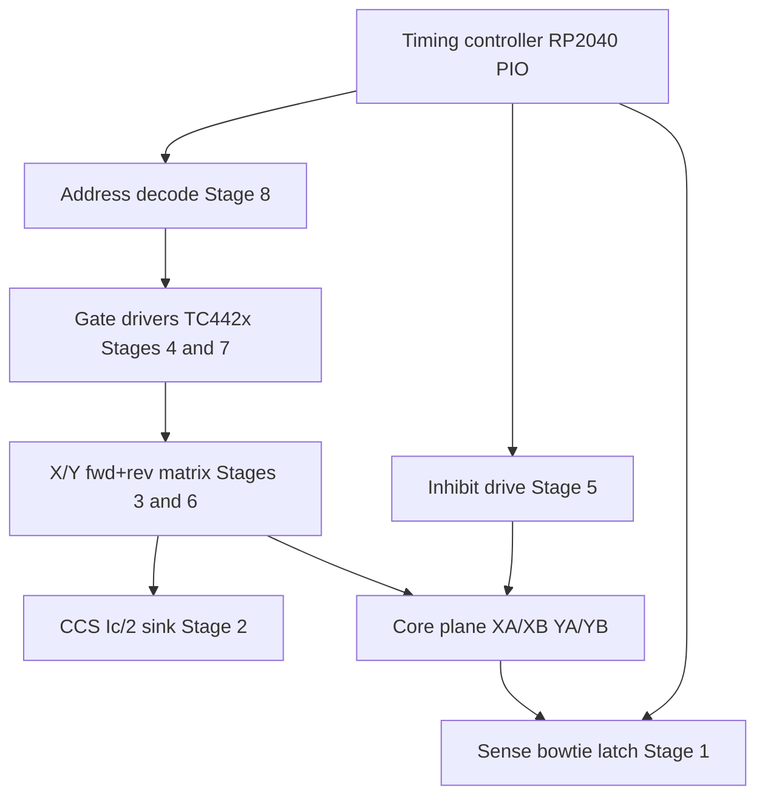

# Major Regions

Logical blocks of the driver system, mapped to schematic stages and the core-plane interface. Normative connector geometry is in [design_spec.md](design_spec.md).

## Block overview

## Region map

| Region | Schematic status | Primary parts | Role |
|--------|------------------|---------------|------|
| Sense / bowtie / latch | **Stage 1** on sheet | TLV3501, BAT54S, 74AHC74, soft mid bias | Differential sense across YB65/66; clamp; strobe latch to DOUT |
| CCS (\(I_c/2\) sink) | **Stage 2** on sheet | TL431, Bourns 3296W, OPA192, IRLZ44N, 1 Ω sense | Regulated half-select return for low-side drivers |
| Address decode | **Stage 8** on sheet (Y0 only) | 74AHC138 ×4 + 74AHC125 ×2 | Address → `DEC_*0`; FWD/REV buffers into Stage-4/7 `*_n` / `*r_n` |
| X/Y drive + gate drive | **Stages 3–4** fwd, **6–7** rev (1×1) | FDS8958A, SS14, TC4427A/TC4426A | Forward READ + reverse WRITE half-bridges on XA0/XB0 & YA0/YB0 |
| Inhibit drive | **Stage 5** on sheet | FDS8958A, TC4427A/TC4426A on `INH_EN_n` | Series \(-I_c/2\) on folded sense (YB65→bowtie→YB66→CCS); no 4th inhibit wire |
| Plane connectors | Lib + footprints | CoreEdge XA/XB 64, YA/YB 66 | Dual-readout staggered card edge to the 9″ plane |
| Timing controller | Spec only | RP2040 / Pico (off-board or later) | Deterministic READ / STROBE / INHIBIT / WRITE |
| Testability | Partial | Keystone-style TPs; 2N7002 + LEDs planned | TP1 DOUT, TP2 Isense present; decoder/data LEDs not yet |

## Stage 1 — Sense / bowtie

On [kicad/core/core.kicad_sch](../kicad/core/core.kicad_sch):

- Differential inputs from the folded loop (bowtie feedback / isolation network into the comparator)
- BAT54S clamps to protect the amp during inhibit spikes
- Soft mid-bias to AGND so the loop sits at a safe common-mode
- TLV3501 comparator → 74AHC74 clocked by SENSE STROBE

See [theory_of_operation.md](theory_of_operation.md) for the strobe window and [component_selection.md](component_selection.md) §4 for part rationale.

## Stage 2 — CCS

Common low-side return through a linear MOSFET throttle. The OPA192 closes the loop around the 1 Ω sense resistor so pulse current stays at the trimpot setpoint despite inductive kick. Heat in the throttle MOSFET is expected; package choice (IRLZ44N or alternate) must allow linear-region dissipation.

## Stages 3–8 (on sheet) and remaining work

**Stages 3–4** — forward X0/Y0 half-bridges (FDS8958A + SS14) plus TC4427A/TC4426A with 10 kΩ pull-ups on `*_n`.

**Stage 5 — Inhibit** reuses the sense wire (YB65 → fold at YA65/66 → YB66 → CCS). Soft mid + 1 kΩ iso (Stage 1) keep inhibit off AGND and off `SENSE_*`. Polarity convention relative to READ remains open ([design_choices.md](design_choices.md)).

**Stages 6–7 — Reverse WRITE (1×1)** — second FDS8958A pair with ends swapped (HS→XB0/YB0, LS←XA0/YA0), shared `CCS_RET`, plus TC442x on `*r_n` (headers J6–J9 until decode steers).

**Stage 8 — Decode (prototype)** — 74AHC138 ×4 with only `~Y0` used (`DEC_XH0`…`DEC_YL0`); 74AHC125 ×2 steers into forward `*_n` or reverse `*r_n` via `FWD_EN_n` / `REV_EN_n` (active-low OE; do not assert both). `ADDR_A[2:0]` default 000 via pull-downs; `DEC_EN` defaults off. Scaling to 8×8 = wire more 138 outputs + more FDS8958A banks.

**Bench plane map (1×1):** drive `XA0`/`XB0`/`YA0`/`YB0`; sense still on YB65/66 fold. Full cycle: CCS setpoint → FWD READ → strobe → INHIBIT → REV WRITE.

**Connectors** use custom footprints sized from the plane: 32-position dual-readout for X (64 pins), 33-position for Y (66 pins). Pin stagger and first-pin offset are normative in the design spec.

## Plane interface (summary)

| Axis | Connectors | Pins | Notes |
|------|------------|------|-------|
| X | XA, XB | 64 | Drive lines only |
| Y | YA, YB | 66 | 64 drive + YA/YB 65–66 folded sense (READ + inhibit; no 4th wire) |

Physical photos: [img/core_pcb_top.png](img/core_pcb_top.png), [img/core_pcb_bot_mirror.png](img/core_pcb_bot_mirror.png).
