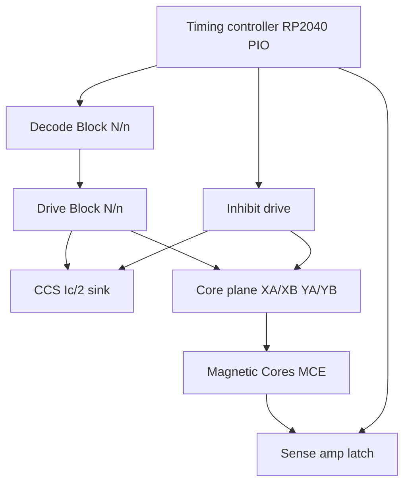

# Major Regions

Functional blocks of the driver system and the core-plane interface. Normative connector geometry is in [design_spec.md](design_spec.md). Schematic ground truth: [kicad/core/core.kicad_sch](../kicad/core/core.kicad_sch).

## Block overview



## Region map

| Block | On sheet | Primary parts | Role |
|-------|----------|---------------|------|
| **Sense** | [`sense.kicad_sch`](../kicad/core/sense.kicad_sch) | TLV3501, BAT54S, 74AHC74, 1k iso | Differential sense across YA65/YB66; clamp; strobe latch to DOUT |
| **Magnetic Cores** | [`magnetic_core_2x2.kicad_sch`](../kicad/core/magnetic_core_2x2.kicad_sch) | MCE×4, soft mid R1 | 2×2 plane model; XA→XB / YA→YB; YA loop TL–BR, YB loop BL–TR; 65/66 at the XB end |
| **CCS** | [`ccs.kicad_sch`](../kicad/core/ccs.kicad_sch) | TL431, Bourns 3296W, OPA192, IRLZ44N, 1 Ω sense | Regulated half-select return for low-side drivers |
| **Inhibit** | [`inhibit.kicad_sch`](../kicad/core/inhibit.kicad_sch) | FDS8958A, TC4427A×2, 2N7002 invert | Series \(-I_c/2\) on folded sense (YA65→fold→YB66→CCS); no 4th inhibit wire |
| **Drive** | Mid (sheet ×32) | `drive_block` | TC4427A + FDS8958A + local VDRIVE C30/C31; pins `N_*` / `N_HS_OUT`/`N_LS_OUT`; groups 0–7, both axes, FWD and REV |
| **Decode CTRL** | [`decode_ctrl.kicad_sch`](../kicad/core/decode_ctrl.kicad_sch), [`decode_ctrl_y.kicad_sch`](../kicad/core/decode_ctrl_y.kicad_sch) | J40–J54, R40–R54 | `ADDR_NH/NL` headers; X sheet also `BANK_EN` / `DEC_EN` / `REV_EN_n` |
| **Decode** | Lower (sheet ×1) | `decode_block` | One axis: 138 HS + 238 LS + local +3V3 C19/C20; pins `N_*`; root wires X FWD |
| **Decoupling Logic** | Bottom (sheet) | `decoupling_logic` | +3V3/+5V bypass (Sense, Latch, CCS) |
| **Decoupling VDRIVE** | Bottom (sheet) | `decoupling_vdrive` | VDRIVE 100n+1u for Inhibit TC4427s (U7/U8) |
| Plane connectors | Lib + footprints | CoreEdge XA/XB 64, YA/YB 66 | Dual-readout staggered card edge to the 9″ plane |
| Timing controller | Spec only | RP2040 / Pico (off-board or later) | Deterministic READ / STROBE / INHIBIT / WRITE |
| Testability | Partial | Keystone-style TPs; 2N7002 + LEDs planned | TP1 DOUT, TP2 Isense present; decoder/data LEDs not yet |

## Sense

Hierarchical page [`sense.kicad_sch`](../kicad/core/sense.kicad_sch) (root sheet **Sense**). Pins: `YA65`/`YB66` only. `SENSE_STROBE` / `DOUT` are global labels.

- Differential inputs from the series fold (1 kΩ from `YA65` into `SENSE_P`, 1 kΩ from `YB66` into `SENSE_N`)
- BAT54S clamps to protect the amp during inhibit spikes
- TLV3501 comparator → 74AHC74 clocked by SENSE STROBE

The plane model (MCE) and soft mid-bias live on **Magnetic Cores**. See [theory_of_operation.md](theory_of_operation.md) for the strobe window and [component_selection.md](component_selection.md) §4 for part rationale.

## Magnetic Cores

Hierarchical page [`magnetic_core_2x2.kicad_sch`](../kicad/core/magnetic_core_2x2.kicad_sch) (root sheet **Magnetic Cores**). Each core is an MCE: the six-pin layout of the old ferrite-bead stand-in, drawn as a diagonal toroid, with the [core-element](core_element_sim.md) SPICE model attached.

**Drive hierarchy pins (0-based matrix only):** `XA0`/`XA1`/`XB0`/`XB1`, `YA0`/`YA1`/`YB0`/`YB1` — same semantic class as physical contacts 1–64, indexed 0–63 in the schematic. These participate in the Drive/Decode pin story.

**Sense / fold nets (not Drive/Decode hierarchy):** `YA65`, `YB65`, `YA66`, `YB66`, `SENSE_FOLD` — physical Y pins 65/66 plus the driver center tap; different function (fold + sense/inhibit). On the stand-in sheet they are local labels (and optionally exported for Sense/Inhibit), **not** an extension of the drive switch-node chain. Soft mid R1 10k→AGND at `SENSE_FOLD` (`YA66` tied to `YB65`). The plane does not shunt the loops.

2×2 MCE array matching plane markings ([img/top.jpeg](img/top.jpeg)):

```text
        XA0              XA1
         |                |
   YB0 --● MCE00 ---- ● MCE01 -- YA0
         |                |
   YB1 --● MCE10 ---- ● MCE11 -- YA1
         |                |
        XB0              XB1
```

- **X** top→bottom: `XA0`→MCE00→MCE10→`XB0`; `XA1`→MCE01→MCE11→`XB1`
- **Y** right→left: `YA0`→MCE01→MCE00→`YB0`; `YA1`→MCE11→MCE10→`YB1`
- **Sense (two loops + external fold):**
  - Loop A, the top-left to bottom-right pass (stands in for 2,048): `YA65` ↔ MCE11 ↔ MCE00 ↔ `YA66`. Both ends leave at the YA–XB corner, beside MCE11.
  - Loop B, the bottom-left to top-right pass (the other 2,048): `YB65` ↔ MCE10 ↔ MCE01 ↔ `YB66`. Both ends leave at the YB–XB corner, beside MCE10.
  - Center tap: `YA66`═`YB65` (`SENSE_FOLD`) + R1 10k→AGND
  - Full series path: `YA65` → Loop A → fold → Loop B → `YB66`
- **Symbol:** diagonal ellipse (toroid). X1/X2 top/bot, Y1/Y2 left/right, S1/S2 on the LL→UR diagonal. **MCE00** and **MCE11** are mirrored about Y so that diagonal becomes UL→LR, matching the plane’s top-left to bottom-right sense pass. MCE01 and MCE10 stay unmirrored.

Each X/Y line pierces only the cores on its column/row. Regen: [`gen_ferrite_beads_page.py`](../kicad/scripts/gen_ferrite_beads_page.py) `--phase 2`.

## CCS

Hierarchical page [`ccs.kicad_sch`](../kicad/core/ccs.kicad_sch), called three times. Pin: `CCS_RET`. Root binds **CCS X** → `CCS_X` (X drive), **CCS Y** → `CCS_Y` (Y drive), **CCS INH** → `CCS_INH` (inhibit). One shared sink cannot hold 400 mA on X and on Y at the same time; the cycle deck is the evidence. Each instance carries its own +5 V 100 nF + 1 µF.

Common low-side return through a linear MOSFET throttle. The OPA192 closes the loop around the 1 Ω sense resistor so pulse current stays at the trimpot setpoint despite inductive kick. Heat in the throttle MOSFET is expected; package choice (IRLZ44N or alternate) must allow linear-region dissipation.

## Inhibit

Hierarchical page [`inhibit.kicad_sch`](../kicad/core/inhibit.kicad_sch) (root sheet **Inhibit**). Pins: `YA65`/`YB66`, `CCS_RET`, `VDRIVE`; `INH_EN_n` via on-page header J5. Root binds `CCS_RET` to `CCS_INH`.

Reuses the series sense path (`YA65` → Loop A → `YA66`═`YB65` → Loop B → `YB66`). P-FET sources `VDRIVE` into `YA65`; N-FET sinks `YB66` to `CCS_INH`. Soft mid (Magnetic Cores) + 1 kΩ iso (Sense) keep inhibit off AGND and off `SENSE_*`. Both gate drivers are TC4427A: HS←`INH_EN_n`, LS←`INH_LS_en` (2N7002 invert). Whether this direction matches READ polarity on the real cores remains open ([design_choices.md](design_choices.md)).

## Drive Block (2×2)

The sheet is a **function**; root wires are the **call arguments**. Define once with `N`/`n` pins. Root calls it 32 times: groups 0–7, X and Y, FWD and REV. The SS14s for lines 0–63 are on [`steer_2x2.kicad_sch`](../kicad/core/steer_2x2.kicad_sch). See [naming.md](naming.md).

| Sheet | File | Contents |
|-------|------|----------|
| **Drive Block** | [`drive_block.kicad_sch`](../kicad/core/drive_block.kicad_sch) | One half-bridge: TC4427A (HS+LS) + FDS8958A. Pins are the switch nodes |
| **Steer 2x2** | [`steer_2x2.kicad_sch`](../kicad/core/steer_2x2.kicad_sch) | SS14s. Group-0 HS diode-ORs both lines. LS selects the line |
| Root | [`core.kicad_sch`](../kicad/core/core.kicad_sch) | 8× `drive_block` + one steer sheet |

Pin tokens: **`N`** = axis (`X`/`Y`), **`n`** = line (`0`…`63`). Hierarchical pins:

| Pin | Role |
|-----|------|
| `N_HSn` | HS gate input (active-low from 74AHC138) |
| `N_LSn` | LS gate input (active-high from 74AHC238) |
| `N_HS_OUT` | P-FET switch node (diode is on the steer sheet) |
| `N_LS_OUT` | N-FET switch node |
| `VDRIVE` / `CCS_RET` | `VDRIVE`; parent `CCS_X` or `CCS_Y` |

Parent polarity suffixes stay on the concrete nets for now. Current root map (X0 FWD):

| Block pin | Parent net |
|-----------|------------|
| `N_HSn` | `X_HS0_n` |
| `N_LSn` | `X_LS0_en` |
| `N_HS_OUT` | `XHS0` (steer diode-ORs this to `XB0` and `XB1` on FWD) |
| `N_LS_OUT` | `XLS0` (steer returns `XA0` through this FET) |

FWD sources B and sinks A. REV swaps the ends (`XHS0R` onto `XA0`/`XA1`, `XLS0R` from `XB0`). Group-1 HS (`XHS1`, `YHS1`, and the REV copies) has no diode on the 2×2. Refs on the first instance: U20, Q10.

## Decode Block (8×8 one axis)

Same **function-call** pattern as Drive: one `decode_block` definition; root passes address/enables and receives gate nets such as `X_HS0_n` / `X_LS0_en` (taxonomy: `[N]_[HS|LS][n][r?]_(n|en)`). Buses (`X_HS[0..7]_n`, …) come when cloning past 1×1 — [naming.md](naming.md).

| Sheet | File | Contents |
|-------|------|----------|
| **Decode Block** | [`decode_block.kicad_sch`](../kicad/core/decode_block.kicad_sch) | One axis: 74AHC138 HS + 74AHC238 LS; all Y0–Y7 wired |
| **Decode CTRL** | [`decode_ctrl.kicad_sch`](../kicad/core/decode_ctrl.kicad_sch), [`decode_ctrl_y.kicad_sch`](../kicad/core/decode_ctrl_y.kicad_sch) | J40–J54 headers + R40–R54 fail-safe pulls. Pins `ADDR_NH/NL`; enables only on the X sheet |
| Root | [`core.kicad_sch`](../kicad/core/core.kicad_sch) | Decode CTRL (X + enables) + Decode CTRL Y + 1× `decode_block` — X FWD bring-up |

Pin tokens: **`N`** = axis (`X`/`Y`), **`n`** = HS/LS bank index (`0`…`7`). Hierarchical pins:

| Pin | Role |
|-----|------|
| `ADDR_NH[2:0]` / `ADDR_NL[2:0]` | HS / LS address into the 3-to-8s |
| `BANK_EN` / `DEC_EN` | `~E0` / `E2` ( `~E1`←GND ) |
| `N_HS{0..7}_n` | HS outs (active-low) |
| `N_LS{0..7}_en` | LS outs (active-high) |

`line# = 8·HS + LS`. Parent polarity suffixes stay on concrete nets. Current root map (X FWD):

| Block pin | Parent net |
|-----------|------------|
| `ADDR_NH*` / `ADDR_NL*` | `ADDR_XH*` / `ADDR_XL*` |
| `BANK_EN` | `FWD_EN_n` |
| `DEC_EN` | `DEC_EN` |
| `N_HS{0..7}_n` / `N_LS{0..7}_en` | `X_HS*_n` / `X_LS*_en` |

Y / REV instances (`BANK_EN`←`REV_EN_n`, outs → `*r_*`) come later. Refs today: U11/U12.

**Bench plane map:** Drive Block still `XA0`/`XB0` only; Magnetic Cores exposes XA0/1 XB0/1 YA0/1 YB0/1; sense/inhibit outer ends are `YA65`/`YB66`, center tap `YA66`═`YB65`.

## Decoupling (Logic / VDRIVE)

Per-IC bypass lives in the reusable blocks; shared rails stay on two hierarchy pages (global power nets; no hierarchical pins):

| Sheet / block | File | Rails / parts |
|---------------|------|---------------|
| **Drive Block** | [`drive_block.kicad_sch`](../kicad/core/drive_block.kicad_sch) | VDRIVE: C30 100n + C31 1u next to TC4427 |
| **Decode Block** | [`decode_block.kicad_sch`](../kicad/core/decode_block.kicad_sch) | +3V3: C19/C20 100n next to U11/U12 |
| **Decoupling Logic** | [`decoupling_logic.kicad_sch`](../kicad/core/decoupling_logic.kicad_sch) | +3V3: C1/C2 (Sense), C3/C4 (Latch). CCS +5V bypass is C5/C6 on each CCS instance |
| **Decoupling VDRIVE** | [`decoupling_vdrive.kicad_sch`](../kicad/core/decoupling_vdrive.kicad_sch) | VDRIVE: C11–C14 (Inhibit U7/U8) — each 100n+1u pair |

Regen: [`gen_decoupling_pages.py`](../kicad/scripts/gen_decoupling_pages.py) (also regenerates `drive_block` / `decode_block` and strips root caps).

**Connectors** use custom footprints sized from the plane: 32-position dual-readout for X (64 pins), 33-position for Y (66 pins). Pin stagger and first-pin offset are normative in the design spec.

## Plane interface (summary)

| Axis | Connectors | Pins | Notes |
|------|------------|------|-------|
| X | XA, XB | 64 | Drive lines only |
| Y | YA, YB | 66 | **1–64** drive (schematic `YA0`…`YB63`) + **65/66** sense/fold only — not part of Drive/Decode hierarchy |

Physical photos: [img/core_pcb_top.png](img/core_pcb_top.png), [img/core_pcb_bot_mirror.png](img/core_pcb_bot_mirror.png).
