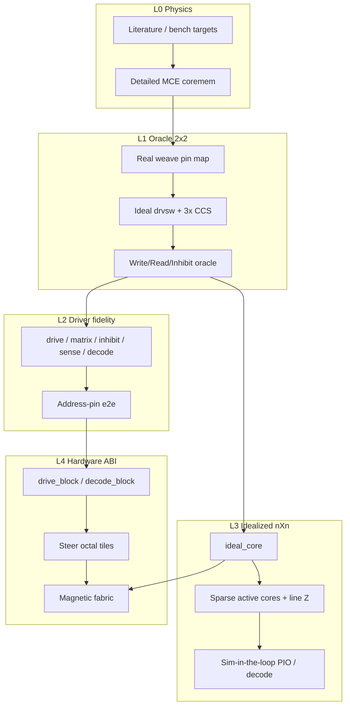

# Reimplementation process (L0–L4)

Ground-up path from a single core element to idealized n×n simulation-in-the-loop, then hardware fabric. Companion retrospective themes: keep the 2×2 fidelity ladder; introduce an idealized core **before** scaling past 2×2; freeze hierarchy for 64 lines early.



## Principles

1. **Fidelity is a dial per layer** — never instance detailed `coremem` at n=64 as the scale proof.
2. **One weave AST** ([`mce_array.py`](../kicad/scripts/mce_array.py)) generates SPICE, KiCad, and coverage.
3. **Hierarchical boundaries match the 256-end pin budget** — [hierarchy_abi.md](hierarchy_abi.md).
4. **Coverage tables**, not lagging narrative — [coverage_matrix.md](coverage_matrix.md).
5. **No n×n schematic fabric until L2 e2e is green and L3 meets a runtime budget.**

## Layer contracts

### L0 — Detailed single core

| Item | Contract |
|------|----------|
| Model | [`coremem.cir`](../kicad/core_element_sim/models/coremem.cir) / `mce` |
| Deck | [`coremem_tb.cir`](../kicad/core_element_sim/models/coremem_tb.cir) |
| Gates | Half-select hold; read-1 ~tens of mV / ~1 µs; read-0 discrimination; restore polarity |
| Limit | Do not instance more than ~4–16 L0 cores in one transient without a runtime budget check |

### L1 — Oracle array (n=2)

| Item | Contract |
|------|----------|
| Weave | Same pin map as archived 2×2 / `mce_array.assert_matches_2x2()` |
| Drive | Ideal `drvsw` + **three** CCS copies |
| Decks | [`array2x2_cycle_tb.cir`](../kicad/core_element_sim/models/array2x2_cycle_tb.cir) (PASS oracle); [`array2x2_tb.cir`](../kicad/core_element_sim/models/array2x2_tb.cir) (**FAIL** single-CCS record) |
| Gates | Remanence after write/read/inhibit; sense plateau; no half-select flips |

### L2 — Driver fidelity (still n=2)

Replace ideals one block at a time: drive → matrix → inhibit → sense → decode e2e → strobe.

| Deck | Proves |
|------|--------|
| `array2x2_drive_tb` | One real `drvleg` |
| `array2x2_matrix_tb` | Diode steering |
| `array2x2_inhibit_tb` | Series inhibit + `CCS_INH` |
| `array2x2_sense_tb` | Front-end + latch |
| `array2x2_e2e_tb` | Cycle from `ADDR_*` / enables / strobe |
| `array2x2_strobe_tb` | 300 ns into flat latches |

Freeze schematic ABI here ([icd.md](icd.md) §5–§6).

### L3 — Idealized n×n + SIL

| Item | Contract |
|------|----------|
| Model | [`ideal_core.cir`](../kicad/core_element_sim/models/ideal_core.cir) — threshold remanence + fixed sense injection |
| Plant | All lines present; sparse active cores (diagonal + neighbors) or O(1) behavioral sources |
| Runtime | Full diagonal or random pattern in **one** continuous run finishes in minutes |
| SIL | Same address/enable nets as L2; plant is idealized (PIO stimulus may be synthetic) |
| Gates | Coincidence only at intersection; inhibit blocks write-1; sense discrimination; decode selects the right line pair |

Do **not** use L0 `coremem` for n=64 scale proof. The legacy behavioral diagonal smoke (`array64x64_cycle_*.cir`) remains a characterization aid, not the L3 gate.

### L4 — Hardware fabric

Only after L2 green and L3 runtime OK:

- Steer as **octal tiles** (or equivalent bus ABI) — not one 320-pin sheet
- Magnetic plane from weave AST; schematic may condense while SPICE uses L3
- Sheet names match scale (`steer_64`, `steer_octal_*`)
- Regen via [`gen_pipeline.py`](../kicad/scripts/gen_pipeline.py); coverage auto-updated

## Milestones

1. ICD freeze — [icd.md](icd.md)
2. L0/L1 regression suite — `kicad/core_element_sim/run_regression.sh`
3. L2 block library — 2×2 e2e only until green
4. L3 ideal plant — `ideal_core` + ideal diagonal / n×n decks
5. L4 tiled fabric — [hierarchy_abi.md](hierarchy_abi.md)
6. Bench calibration — retune L0/L3 from measured \(I_c\), inhibit polarity, sense noise

## Regression entry point

```bash
kicad/core_element_sim/run_regression.sh          # L0 + L1 (+ optional L2)
kicad/core_element_sim/run_regression.sh --ideal  # also L3 ideal smoke
uv run python kicad/scripts/gen_pipeline.py --help
```
