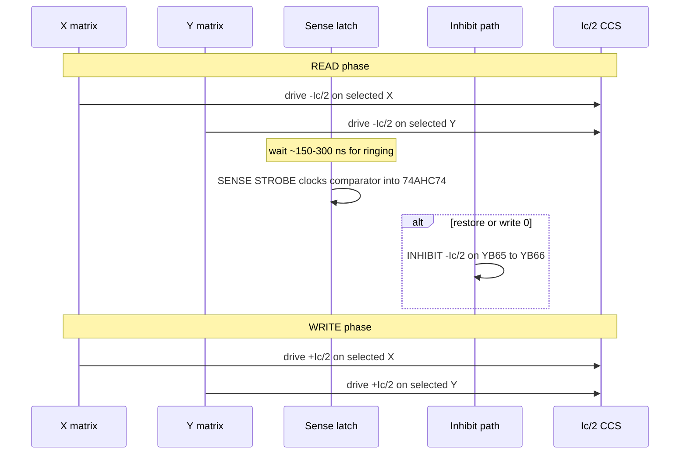

# Theory of Operation

How the driver board reads and writes a single bit on the 64×64 ferrite core plane.

## Core physics (brief)

Each ferrite core stores one bit as magnetic remanence in one of two directions. A full-select current \(I_c\) through a core flips its state; half-select \(I_c/2\) does not. Addressing one bit means driving \(I_c/2\) on one X line and \(I_c/2\) on one Y line so only the intersection sees \(I_c\).

Readout is destructive: the READ pulse forces the core toward a known polarity. If the core was previously the opposite polarity, it flips and induces a millivolt-scale spike on the sense wire; if it was already that polarity, the spike is negligible. After sensing, a WRITE (restore) pulse returns the desired data, optionally with an INHIBIT current so a restore-to-0 does not flip the core back to 1.

For this plane, expect \(I_c\) in the 400–800 mA range (0.125″ cores), so regulated half-select is about 200–400 mA. See [design_spec.md](design_spec.md) for the normative numbers. A separate ngspice model of one 50-mil toroid, and how its sense pulse compares with the published read-1, is in [core_element_sim.md](core_element_sim.md).

## Three wires per core (no inhibit winding)

Each ferrite core is threaded by exactly **three** wires:

| Wire | Count on plane | Role |
|------|----------------|------|
| **X** | 64 lines | Half-select address |
| **Y** | 64 lines | Half-select address |
| **Sense** | One long wire through all 4,096 cores | READ pickup **and** WRITE-0 inhibit |

This is classic 3-wire core memory: there is **no fourth inhibit winding**. Inhibit current is **time-multiplexed onto the sense wire** (high current during WRITE/RESTORE 0; quiet differential sensing during READ). Full-fold driver ends are `YA66`/`YB66`; the fold mid is `YA65`═`YB65`.

## Folded sense / inhibit loop

The plane has no separate sense connector beyond pins 65/66 on the Y edges. Sense is two **separate half-loops** that meet at a fold shunt:

| Half-loop | Path through cores | Ends |
|-----------|--------------------|------|
| **YA loop** | Sense through one half of the array | `YA65` ↔ `YA66` |
| **YB loop** | Sense through the other half | `YB65` ↔ `YB66` |

**Fold shunt:** `YA65` is tied to `YB65` (not YA65–YA66). The full series sense/inhibit path is therefore:

```text
YA66 ── YA half ── YA65 ════ YB65 ── YB half ── YB66
                         │
                      R1 10k → AGND   (soft mid at the fold)
```

- **READ:** Differential sense across the fold ends `YA66` / `YB66` (full path), or bring-up may probe one half (`YB65`/`YB66`) only.
- **INHIBIT:** Series \(-I_c/2\) end-to-end on `YA66` ↔ `YB66` puts both halves (all cores) in series; current crosses the `YA65`═`YB65` shunt.
- **Soft mid:** 10 kΩ from the fold (`YA65`/`YB65`) → AGND, not a hard AGND short, so inhibit current continues through the other half into the CCS instead of dumping at the mid.

Plane photos: [img/](img/); sources in [references.md](references.md). Earlier notes that called the bare-wire fold “YA65–YA66” were wrong — the stand-in and corrected model shunt **YA65–YB65**.


## Access cycle

Every access is a READ / RESTORE sequence. Software bit-banging on a general-purpose MCU is too jittery; the plan is deterministic sequencing from RP2040 PIO (or equivalent hardware state machine).



1. **READ** — Drive \(-I_c/2\) into the addressed X and Y lines (forward polarity for read). Only the selected core sees full \(I_c\).
2. **SENSE STROBE** — After ~150–300 ns for capacitive ringing to settle, clock the D flip-flop that samples the TLV3501 comparator across the fold ends (`YA66`/`YB66` full path; bring-up may use `YB65`/`YB66` for the YB half only).
3. **INHIBIT** — If writing or restoring a 0, drive \(-I_c/2\) through the folded sense path (`YA66` ↔ `YB66` via `YA65`═`YB65`) so the subsequent WRITE cannot flip that core to 1.
4. **WRITE** — Drive \(+I_c/2\) into the same X and Y lines (reverse polarity) to restore or write 1 when inhibit is off.

## Constant-current sink

Low-side matrix returns share an adjustable constant-current sink that holds \(I_c/2\) flat into the inductive load. The CCS block on the schematic implements this with a TL431 reference, multi-turn trimpot, OPA192 feedback amp, IRLZ44N throttle MOSFET, and a 1 Ω sense resistor. Without regulation, pulse amplitude would wander with temperature, MOSFET Rds(on), and wiring resistance, corrupting half-select margins.

## Timing controller

Sub-microsecond edges and fixed delays (strobe window, inhibit overlap, write width) need cycle-accurate hardware. The design targets Raspberry Pi Pico / RP2040 PIO blocks driven by tight C or assembly, independent of the main CPU’s interrupt load. Firmware is out of scope for this document set; the electrical contract is in [design_spec.md](design_spec.md) §5.
