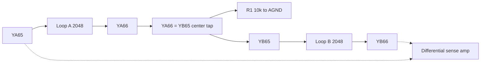
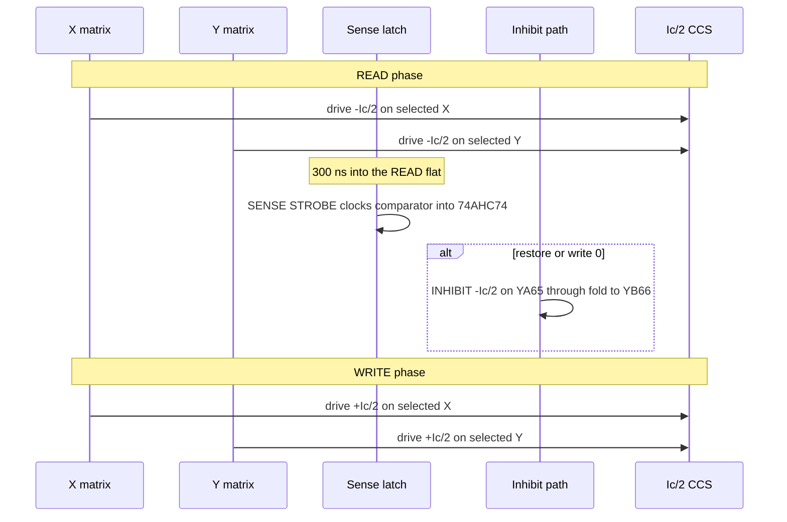

# Theory of Operation

How the driver board reads and writes a single bit on the 64×64 ferrite core plane.

## Core physics (brief)

Each ferrite core stores one bit as magnetic remanence in one of two directions. A full-select current \(I_c\) through a core flips its state; half-select \(I_c/2\) does not. Addressing one bit means driving \(I_c/2\) on one X line and \(I_c/2\) on one Y line so only the intersection sees \(I_c\).

Readout is destructive: the READ pulse forces the core toward a known polarity. If the core was previously the opposite polarity, it flips and induces a millivolt-scale spike on the sense wire; if it was already that polarity, the spike is negligible. After sensing, a WRITE (restore) pulse returns the desired data, optionally with an INHIBIT current so a restore-to-0 does not flip the core back to 1.

For this plane, expect \(I_c\) in the 400–800 mA range (0.125″ cores), so regulated half-select is about 200–400 mA. See [design_spec.md](design_spec.md) for the normative numbers. A separate ngspice model of one 50-mil toroid, and how its sense pulse compares with the published read-1, is in [core_element_sim.md](core_element_sim.md).

## Three wires per core (no inhibit winding)

Each ferrite core is threaded by exactly **three** wires:

| Wire | Count on plane | Role |
|------|----------------|------|
| **X** | 64 lines | Half-select address |
| **Y** | 64 lines | Half-select address |
| **Sense** | Two independent loops, 2,048 cores each | READ pickup **and** WRITE-0 inhibit |

This is classic 3-wire core memory: there is **no fourth inhibit winding**. Inhibit current is **time-multiplexed onto the sense wire** (high current during WRITE/RESTORE 0; quiet differential sensing during READ). The plane does not join the two loops. The driver board ties them in series. Outer ends are `YA65`/`YB66`; the center tap is `YA66`═`YB65`.

## Dual sense / inhibit loops

The plane has no separate sense connector beyond pins 65/66 on the Y edges. Those four terminals are two **independent** 3-wire loops. Vintage 4K planes split the sense/inhibit winding this way so each loop has about half the inductance, DC resistance, and transmission delay of one weave through all 4,096 cores. No numeric L or DCR is recorded here; each loop is half of that former single-weave estimate. Series connection on the driver presents the sum, which is the old full-array L and DCR.

| Loop | Path through cores | Ends |
|------|--------------------|------|
| **Loop A** | 2,048 cores (geographic split untraced) | `YA65` ↔ `YA66` |
| **Loop B** | The other 2,048 cores | `YB65` ↔ `YB66` |

**External fold:** the driver ties `YA66` directly to `YB65`. That center-tap jumper is not on the plane. The full series sense/inhibit path is:

```text
YA65 ── Loop A (2048) ── YA66 ════ YB65 ── Loop B (2048) ── YB66
                              │
                         R1 10k → AGND   (soft ground at the center tap)
```

- **READ:** Differential sense across the outer ends `YA65` / `YB66` (1 kΩ isolation into `SENSE_P` / `SENSE_N`).
- **INHIBIT:** Source \(V_{drive}\) into `YA65`, traverse Loop A, cross the `YA66`═`YB65` jumper, traverse Loop B, and sink `YB66` into `CCS_INH`. Series \(-I_c/2\) puts all 4,096 cores in one string. Because the halves are in series, \(V_{drive}\) headroom and the inhibit sink stay at the single-weave values. X and Y each have their own sink (`CCS_X`, `CCS_Y`) so coincident half-select is \(I_c/2\) on each axis.
- **Soft ground:** 10 kΩ from the center tap (`YA66`/`YB65`) → AGND, not a hard AGND short, so inhibit current continues through Loop B into the CCS instead of dumping at the mid.

The schematic array is the 2×2 on the Magnetic Cores sheet. Loop A is the top-left to bottom-right pass (`YA65`↔MCE11↔MCE00↔`YA66`), with MCE00 and MCE11 mirrored so the sense pins follow that diagonal; both ends sit at the YA–XB corner. Loop B is the other diagonal (`YB65`↔MCE10↔MCE01↔`YB66`), ends at the YB–XB corner. X and Y address lines on that sheet are unchanged. Plane photos: [img/](img/); sources in [references.md](references.md).



## Access cycle

Every access is a READ / RESTORE sequence. Software bit-banging on a general-purpose MCU is too jittery; the plan is deterministic sequencing from RP2040 PIO (or equivalent hardware state machine).



1. **READ** — Drive \(-I_c/2\) into the addressed X and Y lines (forward polarity for read). Only the selected core sees full \(I_c\).
2. **SENSE STROBE** — 300 ns into the READ flat, clock the D flip-flop that samples the TLV3501 comparator across the outer ends `YA65` / `YB66`. Earlier than that, the flip plateau is not up yet, and `DOUT` does not reach a logic 1.
3. **INHIBIT** — If writing or restoring a 0, drive \(-I_c/2\) from `YA65` through both loops and the `YA66`═`YB65` center tap, sinking at `YB66`, so the subsequent WRITE cannot flip that core to 1.
4. **WRITE** — Drive \(+I_c/2\) into the same X and Y lines (reverse polarity) to restore or write 1 when inhibit is off.

## Constant-current sink

X lines, Y lines, and the inhibit path each return through their own adjustable constant-current sink (`CCS_X`, `CCS_Y`, `CCS_INH`). Each holds \(I_c/2\) flat into its load. The CCS block is one sheet, called three times: TL431 reference, multi-turn trimpot, OPA192 feedback amp, IRLZ44N throttle MOSFET, and a 1 Ω sense resistor. Without regulation, pulse amplitude would wander with temperature, MOSFET Rds(on), and wiring resistance, corrupting half-select margins. One shared return cannot supply X and Y together; the two lines would split the current and stay under \(H_c\).

## Timing controller

Sub-microsecond edges and fixed delays (strobe window, inhibit overlap, write width) need cycle-accurate hardware. The design targets Raspberry Pi Pico / RP2040 PIO blocks driven by tight C or assembly, independent of the main CPU’s interrupt load. Firmware is out of scope for this document set; the electrical contract is in [design_spec.md](design_spec.md) §5.
